country analysis
================
Muxin Li
2026-01-23

``` r
library(tidyverse)
```

    ## ── Attaching core tidyverse packages ──────────────────────── tidyverse 2.0.0 ──
    ## ✔ dplyr     1.1.4     ✔ readr     2.1.5
    ## ✔ forcats   1.0.0     ✔ stringr   1.5.1
    ## ✔ ggplot2   3.5.2     ✔ tibble    3.3.0
    ## ✔ lubridate 1.9.4     ✔ tidyr     1.3.1
    ## ✔ purrr     1.1.0     
    ## ── Conflicts ────────────────────────────────────────── tidyverse_conflicts() ──
    ## ✖ dplyr::filter() masks stats::filter()
    ## ✖ dplyr::lag()    masks stats::lag()
    ## ℹ Use the conflicted package (<http://conflicted.r-lib.org/>) to force all conflicts to become errors

``` r
library(haven)
library(ggrepel)
```

``` r
isaac=read_sav("spss/spss19/isaac1_6_7_core_ques_data.sav")|>
  janitor::clean_names()|>
  mutate(country_centre=country+0.01*centre)|>
  select(country_centre,whezev, whez12, awake12, exwhez12)
```

### plot1 x= whezev y=whez12 (high: whezev_prev \>= 0.4 & whez12_prev \>= 0.4)

``` r
isaac_country_centre1=
  isaac|>
  filter(whezev!=9,whez12!=9)|>
  group_by(country_centre) |>
  summarise(
    whezev_prev = mean(whezev == 1, na.rm = TRUE),
    whez12_prev = mean(whez12 == 1, na.rm = TRUE),
    n = n(),
    .groups = "drop"
  )|>
  mutate(
    high_wheeze = whezev_prev >= 0.4 & whez12_prev >= 0.4
  )

ggplot(isaac_country_centre1, aes(x = whezev_prev, y = whez12_prev)) +
  geom_point(aes(color = high_wheeze), alpha = 0.7) +
  geom_text_repel(
    data = subset(isaac_country_centre1, high_wheeze),
    aes(label = country_centre),
    size = 3,
    max.overlaps = Inf
  ) +
  scale_color_manual(
    values = c("grey70", "red"),
    labels = c("Other centres", "High wheeze centres")
  ) +
  labs(
    x = "Ever wheeze prevalence",
    y = "Wheeze in last 12 months prevalence",
    color = ""
  ) +
  theme_minimal()
```

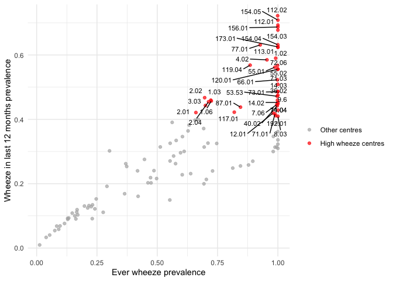<!-- -->

``` r
ggplot(isaac_country_centre1,aes(x=whezev_prev, y = whez12_prev,color=country_centre))+
  geom_point()+
  scale_color_viridis_c(option = "viridis") +
  theme_minimal()
```

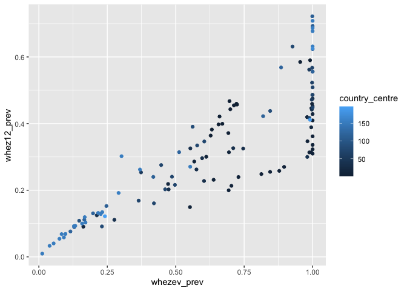<!-- -->

### plot2 x=whezev,y=awake12 (define awake12_prev high is \> 2, high: whezev_prev \>= 0.4 & awake12_prev \>= 0.1 )

``` r
isaac_country_centre2=
  isaac|>
  filter(whezev!=9,awake12!=9)|>
  group_by(country_centre) |>
  summarise(
    whezev_prev = mean(whezev == 1, na.rm = TRUE),
    awake12_prev = mean(awake12 > 2  , na.rm = TRUE),
    n = n(),
    .groups = "drop"
  )|>
  mutate(
    high_wheeze = whezev_prev >= 0.4 & awake12_prev >= 0.1
  )

ggplot(isaac_country_centre2, aes(x = whezev_prev, y = awake12_prev)) +
  geom_point(aes(color = high_wheeze), alpha = 0.7) +
  geom_text_repel(
    data = subset(isaac_country_centre2, high_wheeze),
    aes(label = country_centre),
    size = 3,
    max.overlaps = Inf
  ) +
  scale_color_manual(
    values = c("grey70", "red"),
    labels = c("Other centres", "High wheeze centres")
  ) +
  labs(
    x = "Ever wheeze prevalence",
    y = "One or more nights wake up per week in last 12 months prevalence",
    color = ""
  ) +
  theme_minimal()
```

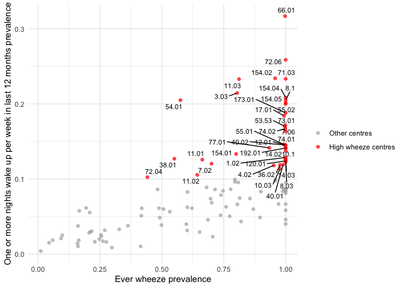<!-- -->

``` r
ggplot(isaac_country_centre2,aes(x=whezev_prev, y = awake12_prev,color=country_centre))+
  geom_point()+
  scale_color_viridis_c(option = "viridis") +
  theme_minimal()
```

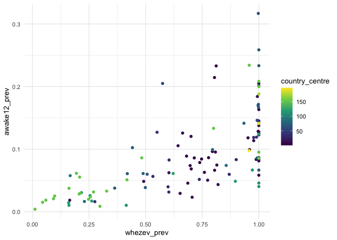<!-- -->

### plot3 x=whezev, y=exwhez12 (high:whezev_prev \>= 0.4 & exwhez12_prev \>= 0.1)

``` r
isaac_country_centre3=
  isaac|>
  filter(whezev!=9,exwhez12!=9)|>
  group_by(country_centre) |>
  summarise(
    whezev_prev = mean(whezev == 1, na.rm = TRUE),
    exwhez12_prev = mean(exwhez12 == 1, na.rm = TRUE),
    n = n(),
    .groups = "drop"
  )|>
  mutate(
    high_wheeze = whezev_prev >= 0.4 & exwhez12_prev >= 0.1
  )

ggplot(isaac_country_centre3, aes(x = whezev_prev, y = exwhez12_prev)) +
  geom_point(aes(color = high_wheeze), alpha = 0.7) +
  geom_text_repel(
    data = subset(isaac_country_centre3, high_wheeze),
    aes(label = country_centre),
    size = 3,
    max.overlaps = Inf
  ) +
  scale_color_manual(
    values = c("grey70", "red"),
    labels = c("Other centres", "High wheeze centres")
  ) +
  labs(
    x = "Ever wheeze prevalence",
    y = "Wheeze during or after exercise",
    color = ""
  ) +
  theme_minimal()
```

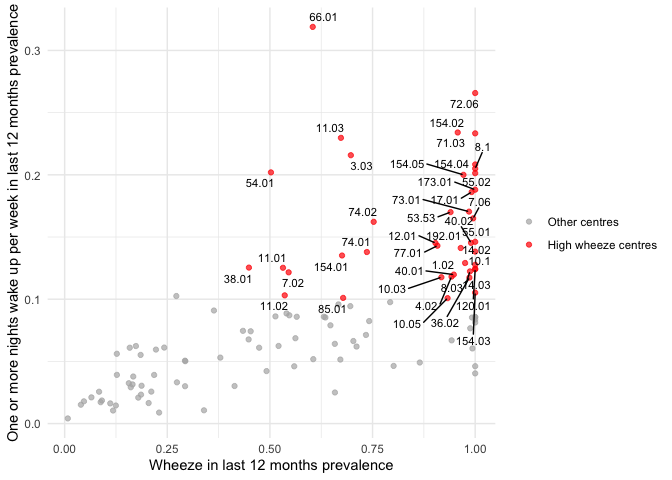<!-- -->

``` r
ggplot(isaac_country_centre3,aes(x=whezev_prev, y = exwhez12_prev,color=country_centre))+
  geom_point()+
  scale_color_viridis_c(option = "viridis") +
  theme_minimal()
```

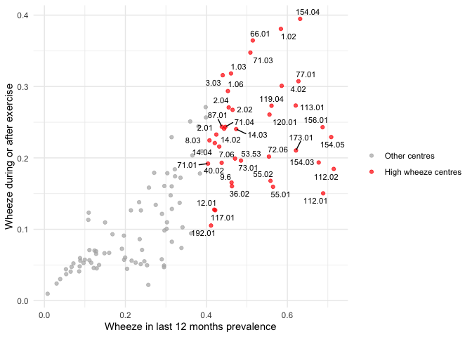<!-- -->

### plot4 x=whez12, y=awake12 (define awake12_prev high is \> 2, high: whez12_prev \>= 0.4 & awake12_prev \>= 0.1 )

``` r
isaac_country_centre4=
  isaac|>
  filter(whez12!=9,awake12!=9)|>
  group_by(country_centre) |>
  summarise(
    whez12_prev = mean(whez12 == 1, na.rm = TRUE),
    awake12_prev = mean(awake12 > 2  , na.rm = TRUE),
    n = n(),
    .groups = "drop"
  )|>
  mutate(
    high_wheeze = whez12_prev >= 0.4 & awake12_prev >= 0.1
  )

ggplot(isaac_country_centre4, aes(x = whez12_prev, y = awake12_prev)) +
  geom_point(aes(color = high_wheeze), alpha = 0.7) +
  geom_text_repel(
    data = subset(isaac_country_centre4, high_wheeze),
    aes(label = country_centre),
    size = 3,
    max.overlaps = Inf
  ) +
  scale_color_manual(
    values = c("grey70", "red"),
    labels = c("Other centres", "High wheeze centres")
  ) +
  labs(
    x = "Wheeze in last 12 months prevalence",
    y = "One or more nights wake up per week in last 12 months prevalence",
    color = ""
  ) +
  theme_minimal()
```

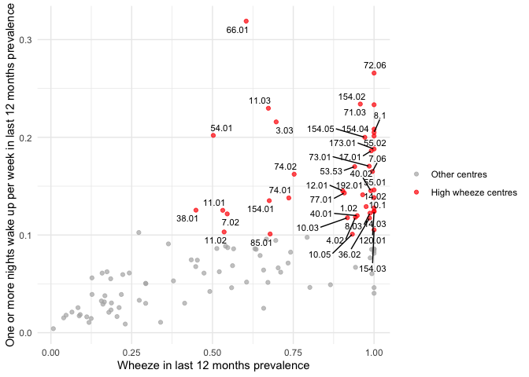<!-- -->

``` r
ggplot(isaac_country_centre4,aes(x=whez12_prev, y = awake12_prev,color=country_centre))+
  geom_point()+
  scale_color_viridis_c(option = "viridis") +
  theme_minimal()
```

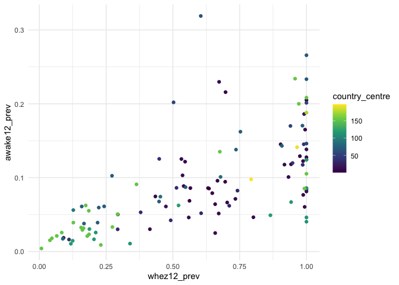<!-- -->

### plot5 x=whez12, y=exwhez12 (high: whez12_prev \>=0.4 and exwhez12_prev\>=0.1)

``` r
isaac_country_centre5=
  isaac|>
  filter(whez12!=9,exwhez12!=9)|>
  group_by(country_centre) |>
  summarise(
    whez12_prev = mean(whez12 == 1, na.rm = TRUE),
    exwhez12_prev = mean(exwhez12 == 1, na.rm = TRUE),
    n = n(),
    .groups = "drop"
  )|>
  mutate(
    high_wheeze = whez12_prev >= 0.4 & exwhez12_prev >= 0.1
  )

ggplot(isaac_country_centre5, aes(x = whez12_prev, y = exwhez12_prev)) +
  geom_point(aes(color = high_wheeze), alpha = 0.7) +
  geom_text_repel(
    data = subset(isaac_country_centre5, high_wheeze),
    aes(label = country_centre),
    size = 3,
    max.overlaps = Inf
  ) +
  scale_color_manual(
    values = c("grey70", "red"),
    labels = c("Other centres", "High wheeze centres")
  ) +
  labs(
    x = "Wheeze in last 12 months prevalence",
    y = "Wheeze during or after exercise",
    color = ""
  ) +
  theme_minimal()
```

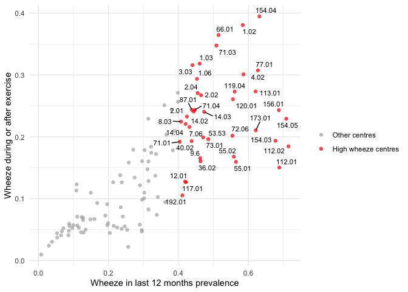<!-- -->

``` r
ggplot(isaac_country_centre5,aes(x=whez12_prev, y = exwhez12_prev,color=country_centre))+
  geom_point()+
  scale_color_viridis_c(option = "viridis") +
  theme_minimal()
```

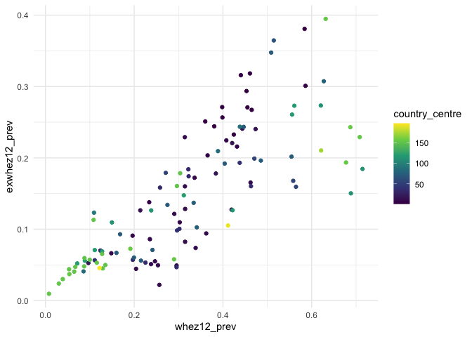<!-- -->

### plot6 x=awake12, y=exwhez12 (define awake12_prev high is \> 2, high: awake12_prev \>= 0.1 & exwhez12 \>=0.1 )

``` r
isaac_country_centre6=
  isaac|>
  filter(exwhez12!=9,awake12!=9)|>
  group_by(country_centre) |>
  summarise(
    exwhez12_prev = mean(exwhez12 == 1, na.rm = TRUE),
    awake12_prev = mean(awake12 > 2  , na.rm = TRUE),
    n = n(),
    .groups = "drop"
  )|>
  mutate(
    high_wheeze = exwhez12_prev >= 0.1 & awake12_prev >= 0.1
  )

ggplot(isaac_country_centre6, aes(x = awake12_prev, y = exwhez12_prev)) +
  geom_point(aes(color = high_wheeze), alpha = 0.7) +
  geom_text_repel(
    data = subset(isaac_country_centre6, high_wheeze),
    aes(label = country_centre),
    size = 3,
    max.overlaps = Inf
  ) +
  scale_color_manual(
    values = c("grey70", "red"),
    labels = c("Other centres", "High wheeze centres")
  ) +
  labs(
    x = "One or more nights wake up per week in last 12 months prevalence",
    y = "Wheeze during or after exercise",
    color = ""
  ) +
  theme_minimal()
```

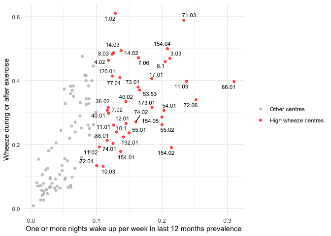<!-- -->

``` r
ggplot(isaac_country_centre6,aes(x=awake12_prev, y = exwhez12_prev,color=country_centre))+
  geom_point()+
  scale_color_viridis_c(option = "viridis") +
  theme_minimal()
```

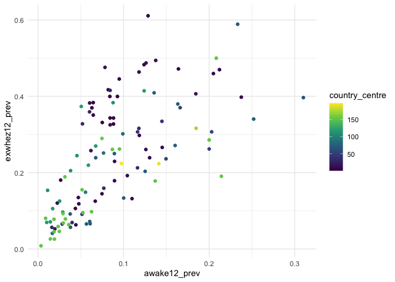<!-- -->

### country centre with whezev_prev\>=0.4,whez12_prev\>=0.4,exwhez12_prev\>=0.1,awake12_prev\>=0.1

``` r
isaac_high_country=
  isaac|>
  filter(whezev!=9,whez12!=9,exwhez12!=9,awake12!=9)|>
  group_by(country_centre) |>
  summarize(
    whezev_prev = mean(whezev==1, na.rm = TRUE),
    whez12_prev = mean(whez12==1, na.rm = TRUE),
    exwhez12_prev = mean(exwhez12 == 1, na.rm = TRUE),
    awake12_prev = mean(awake12 > 2  , na.rm = TRUE),
    n = n(),
    .groups = "drop"
  )|>
  filter(whezev_prev>=0.4,whez12_prev>=0.4,exwhez12_prev>=0.1,awake12_prev>=0.1)

isaac_high_country
```

    ## # A tibble: 41 × 6
    ##    country_centre whezev_prev whez12_prev exwhez12_prev awake12_prev     n
    ##             <dbl>       <dbl>       <dbl>         <dbl>        <dbl> <int>
    ##  1           1.02       0.998       0.975         0.612        0.129   959
    ##  2           3.03       0.801       0.693         0.471        0.216   473
    ##  3           4.02       0.952       0.942         0.464        0.118   703
    ##  4           7.02       0.707       0.548         0.300        0.119   604
    ##  5           7.06       1           0.995         0.471        0.168   191
    ##  6           8.03       1           0.987         0.496        0.127   228
    ##  7           8.1        1           1             0.460        0.205   161
    ##  8          10.0        0.975       0.938         0.15         0.125    80
    ##  9          10.1        1           1             0.239        0.130    46
    ## 10          11.0        0.681       0.543         0.265        0.127   457
    ## # ℹ 31 more rows
